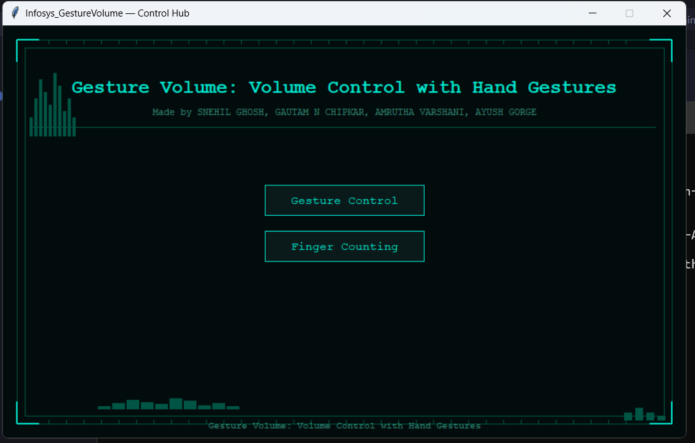
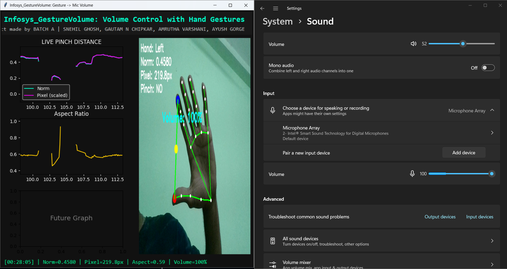
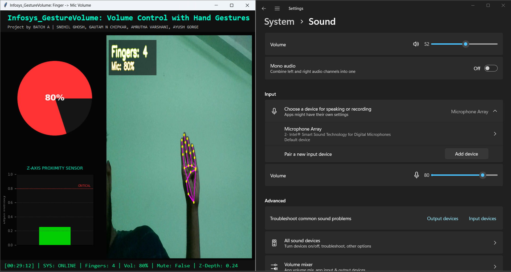

# 🖐️ Infosys GestureVolume — Control with Hand Gestures

> **Real-time microphone volume control using hand gestures via webcam.**  
> Project by **Infosys springboard Internship 6.0 Batch 4-5** — Snehil Ghosh · Gautam N Chipkar · Amrutha Varshani · Ayush Gorge

---

## 📸 Overview

GestureVolume uses your webcam and MediaPipe hand tracking to control your system **microphone volume** in real time — no buttons, no sliders. Just your hand.

Two control modes are available:

| Mode | How it works |
|------|-------------|
| ✋ **Finger Counting** | Show 0–5 fingers → mic volume jumps to 0%, 20%, 40%, 60%, 80%, or 100% |
| 🤏 **Pinch Gesture** | Pinch thumb & index finger and slide apart/together for smooth volume control |

### 📸 Proof of Concept (Mic Volume Control)

*Here you can see the application actively controlling the Windows Sound Settings **Microphone** input volume.*

**1. Control Hub (main.py)**  


**2. Pinch Gesture Mode (Actively Controlling Mic)**  


**3. Finger Counting Mode (Actively Controlling Mic)**  


---

## 🖥️ Requirements

- **OS:** Windows only *(uses `pycaw` + `comtypes` for mic control)*
- **Python:** 3.8 or higher
- **Webcam:** Any standard USB or built-in webcam

### Python Dependencies

Install everything with one command:

```bash
pip install -r requirements.txt
```

| Package | Purpose |
|---------|---------|
| `mediapipe >= 0.10.0` | Hand landmark detection |
| `opencv-python >= 4.5.0` | Webcam capture & frame processing |
| `Pillow >= 9.0.0` | Image display in Tkinter |
| `matplotlib >= 3.5.0` | Live graphs in the HUD |
| `pycaw` | Windows microphone volume control |
| `comtypes` | Windows COM interface (required by pycaw) |
| `keyboard >= 0.13.5` | Optional hotkeys (Ctrl+Alt+Up/Down) |
| `numpy >= 1.21.0` | Numerical operations |

### MediaPipe Model File

Download the hand landmark model and place it in the **project root**:

```bash
curl -o hand_landmarker.task "https://storage.googleapis.com/mediapipe-models/hand_landmarker/hand_landmarker/float16/1/hand_landmarker.task"
```

Or download manually from:  
[https://ai.google.dev/edge/mediapipe/solutions/vision/hand_landmarker](https://ai.google.dev/edge/mediapipe/solutions/vision/hand_landmarker)

---

## 🚀 Getting Started

```bash
# 1. Clone the repo
git clone https://github.com/Light-seekr/ISB_Batch-A_Project.git
cd ISB_Batch-A_Project

# 2. Install dependencies
pip install -r requirements.txt

# 3. Download the model file (if not already present)
curl -o hand_landmarker.task "https://storage.googleapis.com/mediapipe-models/hand_landmarker/hand_landmarker/float16/1/hand_landmarker.task"

# 4. Launch the app
python main.py
```

---

## 📂 Project Structure

```
ISB_Batch-A_Project/
├── main.py                  # Launcher — Control Hub (start here)
├── Finger_controll.py       # Mode 1: Finger Counting
├── Gesture_Controll.py      # Mode 2: Pinch Gesture
├── hand_landmarker.task     # MediaPipe model file (download separately)
├── requirements.txt         # Python dependencies
├── Finger_controll.ipynb    # Jupyter notebook (reference)
└── Gesture_Controll.ipynb   # Jupyter notebook (reference)
```

---

## 🎮 Controls

| Action | Result |
|--------|--------|
| Show 0–5 fingers (Finger mode) | Sets mic to 0–100% in steps |
| Slide pinch apart/together (Gesture mode) | Smoothly adjusts mic volume |
| `Ctrl+Alt+Up` | Increase mic volume by 2% |
| `Ctrl+Alt+Down` | Decrease mic volume by 2% |
| Press `Q` or close window | Exit the app |

---

## ⚠️ Notes

- **Windows only** — mic control relies on Windows Audio APIs (`pycaw`/`comtypes`)
- **Run from terminal** (`python main.py`) — Tkinter GUIs do not work reliably inside Jupyter Lab or VS Code's interactive window
- The `hand_landmarker.task` model file is **not included** in the repo (too large); download it separately using the instructions above
- Make sure your **webcam is accessible** and not in use by another application

---

## 💡 Why We Built This

Every day, students and professionals juggle between meetings, recordings, and calls — constantly reaching for their keyboard to adjust the mic volume at the worst moments. This friction breaks focus and disrupts workflow.

**GestureVolume was built to eliminate that friction entirely.**

In an era where AI and computer vision are reshaping human-computer interaction, we shouldn't need to *touch* a device to control it. This project demonstrates that a consumer webcam and a few hundred lines of Python are enough to build a fully functional, touch-free interface — no special hardware, no proprietary sensors, no dependencies on cloud APIs.

Beyond convenience, this has real-world impact for:
- 🧑‍🦽 **Accessibility** — giving hands-free control to users with motor impairments
- 🎙️ **Streamers & podcasters** — quick mic management without breaking recording flow
- 🏥 **Sterile environments** — touchless device control in medical or lab settings
- 🤖 **HCI research** — a baseline for gesture-driven interface experiments

This project proves that **gesture-based interfaces are not the future — they are already here**, built with open-source tools available to anyone.

---

## 🔭 Future Scope

| Feature | Description |
|---------|-------------|
| 🔊 **Speaker volume control** | Extend beyond mic to control system/speaker volume |
| 🖐️ **Multi-gesture vocabulary** | Map additional gestures to mute, screen brightness, media playback |
| 🌐 **Cross-platform support** | Port mic control to macOS/Linux using `sounddevice` or `pyaudio` |
| 🤖 **Custom gesture training** | Allow users to record and train their own gesture-to-action mappings |
| 📱 **Mobile companion app** | Stream gesture data from a phone camera over Wi-Fi |
| 🔒 **Gesture unlock** | Use hand signature as a biometric authentication trigger |
| 🧠 **LLM integration** | Combine with voice + gesture for a fully touch-free AI assistant interface |

---

## 👨‍💻 Author

**Gautam N Chipkar**  
B.E – Artificial Intelligence & Data Science


---

## ⭐ Support

If you find this project valuable, consider giving it a star ⭐ — it helps others discover it and motivates continued development.

---

## 📄 License

This project was developed as part of the **Infosys springboard Internship 6.0 program** .
